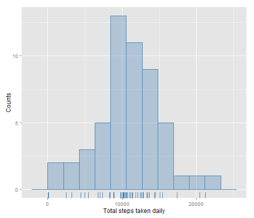
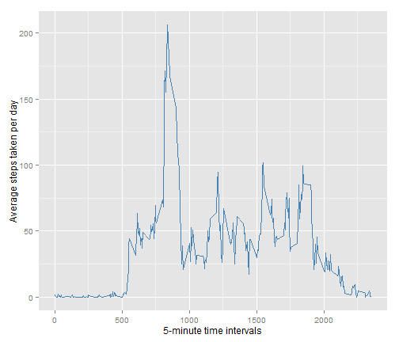
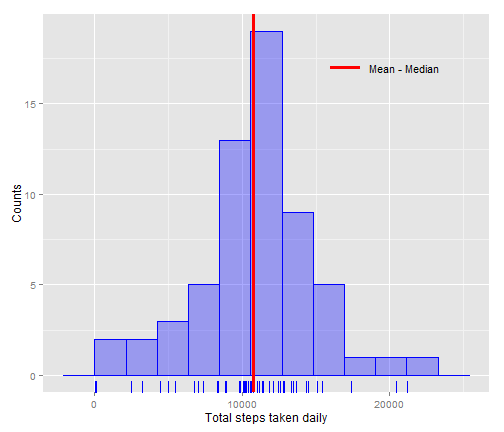
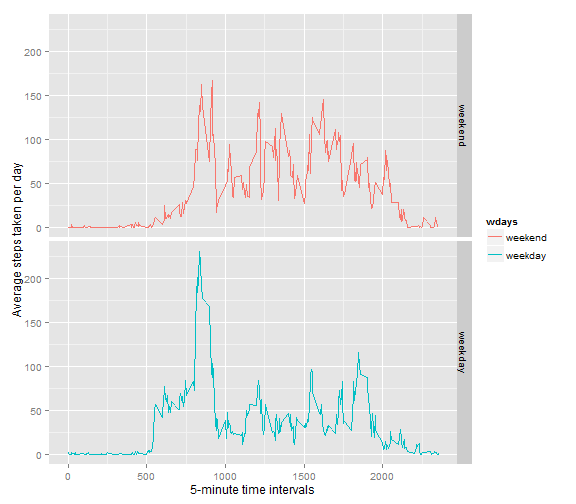

Author: AnVIX --
Date: Friday, July 17, 2015

**Project summary**: personal movement records from activity monitoring devices (PAM) provide an interesting source of large datasets to study patterns, to improve health, and for Maching Learning applications [[1]](#Ref1). PAM datasets remain however generally under-exploited due to technical limitations. This report presents analysis of a PAM set with focus on exploring data properties and identifying activity patterns. Since missing values (i.e., unavailable measurements) are often encountered with data, a strategy to handle this aspect is proposed and examined. Finally, prepared using R Markdown the present document showcases the knitr package [[2]](#Ref2) capabilities to generate dynamic and transparent R reports.

---

### Report sections

* **Data description**
* **Data analysis sections**:
1. **Loading and pre-processing the data**
2. **The mean total number of steps taken per day**
3. **The average daily activity pattern**
4. **Imputing missing values**
5. **Differences in activity patterns between weekdays and weekends**
* **Supplementary material**

---

## Data description

The raw PAM dataset analyzed in this report was recorded using a personal activity monitoring device. The device collected the number of steps taken by an anonymous individual at 5-minute intervals throughout the day. The data consists of two months of measurements performed during October and November, 2012.

The dataset file was obtained from this project's parent or upstream [Github repository](https://github.com/rdpeng/RepData_PeerAssessment1) as of 07-19-2015. Alternatively, the data can be retrieved using this [link](https://d396qusza40orc.cloudfront.net/repdata%2Fdata%2Factivity.zip). The PAM data is stored in a comma separated value (.csv) file (size=52.3 KB) containing 17568 observations of 3 variables. **Table 1** provides a summary of these variables.

|Variable|Type|Description|
|--------|----|-----------|
|steps|numeric|number of steps taken in a 5-minute interval||
|date|factor|date when the measurement was recorded in YYYY-MM-DD format|
|interval|numeric|identifier for the 5-minute interval|
||||

**Table 1**: Description of the PAM dataset variables.

## 1. Loading and pre-processing the data

The first step in the analysis is to read the raw dataset in [R](http://www.r-project.org/). Provided the PAM data file (`activity.zip`) is downloaded to the local working directory, the R code chunk below loads the dataset as a data frame, `data_pam`. The `date` variable is converted to a POSIXct date-time class object using the [lubridate package](http://www.jstatsoft.org/v40/i03/), as will be needed in further analysis.


```r
   library(lubridate)
   unzip("activity.zip", exdir = ".")
   data_pam <- read.csv("activity.csv",sep = ",",na.strings="NA")
   data_pam$date <- ymd(as.character(data_pam$date))
```


Since this data processing step is universal to the analysis, the results are stored -- cached to memory -- by setting option ```cache=TRUE``` in the code chunk.


## 2. The mean total number of steps taken per day

In this section, the PAM dataset missing values, coded as `NA`, are ignored. The effect of this working hypothesis will be investigated later (cf. **Section 4**). Omitting NA's is executed by requiring the `na.action=na.omit` argument in the aggregate() function used to compute summaries of interest. To gain an overview of the person's daily activity, the `steps` variable distribution is examined. The total number of steps taken daily, `total.steps$steps`, are calculated and the related histogram is plotted in **Figure 1**.


```r
   library(ggplot2)
   # Calculate total number of steps taken per day
   total.steps <- aggregate(steps ~ date,data_pam,sum,na.action=na.omit)
   # Estimate bin width & plot histogram
   binw <- (range(total.steps$steps)[2]-range(total.steps$steps)[1])/10.0
   g <- ggplot(total.steps, aes(steps)) + geom_rug(color="steelblue")
   g <- g + geom_histogram(binwidth=binw,alpha=1/3,fill="steelblue",color="steelblue") 
   g <- g + labs(x="Total steps taken daily") + labs(y=expression("Counts")) 
   print(g)
```

 

**Figure 1**: PAM dataset mean total steps taken per day distribution where missing values are ignored.


```r
   # Calculate the mean and median of the total daily steps distribution
   mean.tds <- mean(total.steps$steps)
   median.tds <- median(total.steps$steps)
   sprintf("%s%.1f %s%.1f","Ignoring NA's ** The mean value is:", 
             mean.tds,"& The median is:",median.tds)
```

```
## [1] "Ignoring NA's ** The mean value is:10766.2 & The median is:10765.0"
```

Examining statistics extracted for the total daily steps distribution, PAM-tds, its mean value of: 10766.2 steps is strikingly close to the median: 10765.0 steps. This result suggests that the PAM-tds random variable or sample is symmetrically distributed, with minimal skewness [[3]](#Ref3).

## 3. The average daily activity pattern

To identify activity pattern in the PAM dataset, a time-series plot of the average steps taken daily as a function of the 5-minute interval is generated and shown in **Figure 2**. The average -- arithmetic mean -- number of steps taken, across all days, for each interval are calculated omitting NA's. 


```r
   # Calculate interval means accross all dates
   interv.mean <- aggregate(steps ~ interval,data_pam,mean,na.action=na.omit)
   # Locate interval of maximal activity
   max.activ <- interv.mean[which.max(interv.mean$steps),]
   # Plot time-series
   g <- ggplot(interv.mean,aes(interval,steps)) + geom_line(color="steelblue")
   g <- g + labs(x="5-minute time intervals",y="Average steps taken per day") 
   print(g)
```

 

**Figure 2**: Time-series plot of the average daily activity for all days.

The time-series plot of **Figure 2** clearly discloses a daily activity peak pattern around intervals [810-925]. On average, over all days, the 5-minute interval 835 records the maximum activity (number of steps): ~206 steps. Taking interval 0 as a reference, 00.00 AM, midnight (in a standard time basis of 60 minutes/hour and 24 hours/day), interval 835 corresponds to 8.35 AM. 


## 4. Imputing missing values

In this section, the effect of missing values (NA's) in the PAM dataset and potential bias introduced in the interpretation of the data are addressed. The total number of missing values from the PAM data can be estimated using:


```r
   colSums(is.na(data_pam))
```

```
##    steps     date interval 
##     2304        0        0
```

The `steps` variable comprises 2304 NA entries. For instance, the first day (2012-10-01) of the PAM measurements is consistent with absence of `steps` records for all intervals -- throughout the day. 

The strategy adopted here to fill-in the NA's proposes to estimate the latter from the available data. Specifically, NA's are substituted, on interval-basis, by the appropriate interval mean value (of steps). The needed quantities for each interval, that is the mean value of steps over all days considered in the study, were already estimated (`interv.mean$steps`) in **section 3**. Ultimately, a new dataset `data_pam_na.im` with imputed NA's is created, as executed by the following R script.


```r
   library(dplyr)
   # Create dataset where NA's are replaced by interval means
   data_pam_na.im <- mutate(data_pam, steps=
                            replace(data_pam$steps,is.na(data_pam$steps), 
                            interv.mean$steps))
```

To evaluate the impact of imputing NA's, the total number of steps taken daily are calculated again. As  performed previously in **section 2**, the new total daily steps variable distribution (`PAM-tds-na.im`)  histogram plot is presented in **Figure 3**.


```r
   # Calculate total number of steps/day 
   total.steps.na.im <- aggregate(steps ~ date,data_pam_na.im,sum)
   # Calculate mean and median of the total daily steps distribution
   mean.tds.na.im   <- mean(total.steps.na.im$steps)
   median.tds.na.im <- median(total.steps.na.im$steps)
   sprintf("%s%.1f %s%.1f","Imputing NA's ** The mean value is:", 
             mean.tds.na.im,"& The median is:",median.tds.na.im)
```

```
## [1] "Imputing NA's ** The mean value is:10766.2 & The median is:10766.2"
```


```r
   library(ggplot2)
   # Estimate bin width & plot histogram
   binw <- (range(total.steps.na.im$steps)[2]-range(total.steps.na.im$steps)[1])/10.0
   g <- ggplot(total.steps.na.im, aes(steps)) + geom_rug(color="blue")
   g <- g + geom_histogram(binwidth=binw,alpha=1/3,fill="blue",color="blue") 
   g <- g + geom_vline(xintercept=mean.tds.na.im,color="red",size=1.1)
   g <- g + annotate("text",x=c(21000),y=c(17),label=c("Mean - Median"),size=4)
   g <- g + annotate("segment",x=16000,xend=18000,y=17,yend=17,color="red",size=1.1)
   g <- g + labs(x="Total steps taken daily",y="Counts") 
   #g <- g + labs(title="PAM dataset * NA's imputed - Total steps/day histogram")
   print(g)
```

 

**Figure 3**: PAM dataset mean total steps taken per day distribution where missing values are imputed.

The mean value: 10766.2 steps and median: 10766.2 steps evaluated from the `data_pam_na.im` data are remarkably compatible with those obtained when omitting NA's (10766.2 and 10765.0 steps respectively). Given the strategy adopted here to handle the missing values, one concludes that the omission of the latter has a negligible effect on the interpretation of the data.


## 5. Differences in activity patterns between weekdays and weekends

Having identified daily activity patterns in **section 3**, it is interesting to inspect the PAM data (`data_pam_na.im`, with imputed NA's) for possible activity differences between weekdays (Monday-Friday) and weekends (Saturday-Sunday). To achieve this, a new 2-level factor variable `wdays` is created to indicate whether the `date` variable is a weekend (level:1) or a weekday (level:2). The isWeekday() function of the [timeDate package](https://cran.r-project.org/web/packages/timeDate/timeDate.pdf) is employed to infer `wdays` accordingly. Provided a timeDate object input, isWeekday() performs a logical test to determine if the date is a weekday. If the test fails (i.e., returns FALSE), the date is then a weekend day. The `wdays` variable is added to (combined by column with) the `data_pam_na.im` dataframe.


```r
   library(timeDate)
   wdays <- factor(isWeekday(timeDate(data_pam_na.im$date)),
                   labels=c("weekend","weekday"))
   data_pam_na.im$wdays <- wdays
```

Similarly to the analysis in **section 3**, time-series plots are particularly useful to identify trends within data. The average steps taken daily for weekdays and weekends represented as a function of the 5-minute intervals are shown in the panel plots of **Figure 4** as constructed by this R code.


```r
   # Calculate mean steps per interval and week day
   interv.mean.wd <- aggregate(steps ~ interval+wdays,data_pam_na.im,mean)
   # Generate time-series plots 
   g <- ggplot(interv.mean.wd, aes(interval,steps)) 
   g <- g + geom_line(aes(color=wdays)) + facet_grid(wdays ~ .)
   g <- g + labs(x="5-minute time intervals",y="Average steps taken per day") 
   print(g)
```

 

**Figure 4**: Time-series plots of the average daily activity for weekends (top panel) and weekdays (bottom panel).

The panels comparison in **Figure 4** reveals different activity trends during weekdays and weekends. For instance, during the weekends, the person's activity is characterized by several peak patterns of comparable intensity approximately between intervals [730-1730]. 


## Supplementary material

- The PAM dataset objects properties (data file size and dataframe dimensions) can be retrieved in R using:

```r
   fsize.KB <- round(file.size("activity.zip")/1024,1)
   sprintf("File size: %.1f KB:",fsize.KB)
```

```
## [1] "File size: 52.3 KB:"
```

```r
   # print dataframe dimensions: rows x columns
   dim(data_pam)
```

```
## [1] 17568     3
```

- To test the construction of the new factor variable `wdays` in **section 5**, this code chunk prints the day name and inferred factor for an arbitrary `date` (e.g., 2012-10-05) within the PAM dataset span.

```r
   library(lubridate)
   datet <- "2012-10-05"
   datet.f <- data_pam_na.im[(data_pam_na.im$date == ymd(datet)
                         & data_pam_na.im$interval == 2355),]$wdays
   datet.n <- weekdays(data_pam_na.im[(data_pam_na.im$date == ymd(datet)
                         & data_pam_na.im$interval == 2355),]$date)
   sprintf("Date %s is: %s - Its 'wdays' factor is: %s",datet,datet.n,datet.f)
```

```
## [1] "Date 2012-10-05 is: Friday - Its 'wdays' factor is: weekday"
```


### References

<a name="Ref1"></a> [1] A. Mannini and A.M. Sabatini, "*Machine Learning Methods for Classifying Human Physical Activity from On-Body Accelerometers*", [Sensors 2010,10, 1154-1175](http://www.academia.edu/5940955/Machine_Learning_Methods_for_Classifying_Human_Physical_Activity_from_On-Body_Accelerometers). </a>

<a name="Ref2"></a> [2] Yihui Xie, "*Elegant, flexible and fast dynamic report generation with R*", [knitr package](http://yihui.name/knitr/options/) documentation. </a>

<a name="Ref3"></a> [3] Statistics tutorials and SPSS guides from [Laerd Statistics](https://statistics.laerd.com/statistical-guides/measures-central-tendency-mean-mode-median.php). </a>

[4] R.D. Peng, [Exploratory Data Analysis](https://www.coursera.org/course/exdata) and [Reproducible Research](https://www.coursera.org/course/repdata) lectures, Johns Hopkings University and Coursera Data Science Specialization.

[5] J. Leek, [Getting and Cleaning Data](https://www.coursera.org/course/getdata) lectures, Johns Hopkings University and Coursera Data Science Specialization.

[6] The [ggplot2 package](http://docs.ggplot2.org/0.9.2.1/) documentation.

